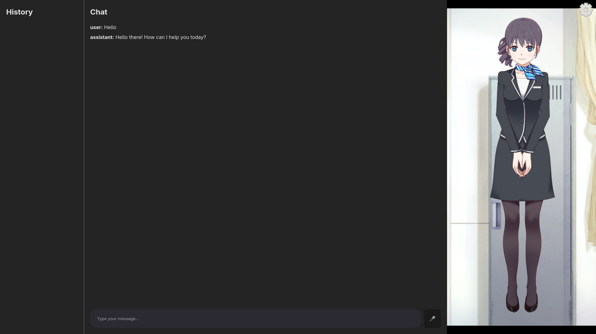

# Amadeus

## 1. Overview

Amadeus is a real-time, interactive conversational AI application. It features a user-friendly chat interface on the frontend, where users can interact with an AI assistant. The assistant is visually represented by a dynamic, animated character powered by Live2D technology, providing a more engaging and personal user experience.

The backend is built with FastAPI and leverages the power of Google's Flash language model via the LangChain framework to generate intelligent and context-aware responses.



## 2. Technology Stack

The project is built using a modern stack of technologies, combining a responsive frontend, a high-performance backend, and cutting-edge AI and animation libraries.

* **Frontend:**
    * **Framework:** A modern JavaScript framework (e.g., React, Vue, Svelte)
    * **Animation:** **Live2D** for real-time 2D character animation.

* **Backend:**
    * **Framework:** **FastAPI** - A high-performance Python web framework for building APIs.
    * **Server:** **Uvicorn** - An ASGI server for running the FastAPI application.

* **AI & Language Model:**
    * **LLM:** **Google Flash** - A fast and efficient language model for generating responses.
    * **Framework:** **LangChain** - A framework used to orchestrate the logic and integration of the language model into the application.

## 3. Architecture Flow

The application follows a simple client-server architecture:

1.  **User Interaction:** The user types a message into the chat interface on the frontend.
2.  **API Request:** The frontend sends the user's message to the FastAPI backend via an API request.
3.  **LLM Processing:** The backend, using LangChain, processes the request and passes it to the Google Flash model.
4.  **Response Generation:** The Google Flash model generates a response.
5.  **API Response:** The FastAPI backend sends the AI-generated response back to the frontend.
6.  **UI Update:** The frontend displays the assistant's response in the chat window. The Live2D character may also animate or change expression based on the context of the conversation.

## 4. Setup and Initialization

To run the Amadeus project locally, you need to start both the frontend and backend servers.

### Frontend

The frontend application is started using the Node Package Manager (npm).

```bash
# Navigate to the frontend project directory
cd /path/to/your/frontend

# To Install dependencies 
npm install

# Start the development server
npm start